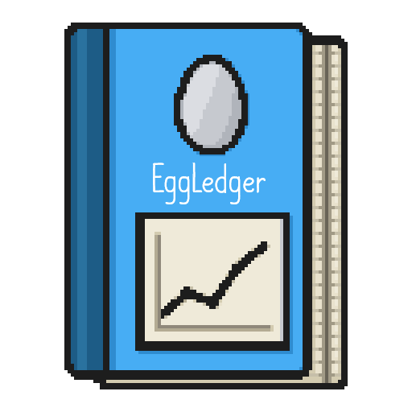

<h1 align="center">
  
</h1>

<p align="center">
  <a href="https://eggledger.davidarthurcole.me/"></a>
  <a href="https://github.com/EggIncTools/EggLedger/releases"></a>
  <a href="https://discord.davidarthurcole.me"></a>
</p>

**EggLedger** exports your Egg, Inc. spaceship mission history, including every loot drop, to `.xlsx` and `.csv`. It extends the [rockets tracker](https://wasmegg-carpet.netlify.app/rockets-tracker/), answering questions that tool can't: "which mission dropped this legendary?" and "how many of this item have I ever pulled?"

## Use it

**Web app: [eggledger.davidarthurcole.me](https://eggledger.davidarthurcole.me/)** - nothing to install. Discord login is used only for identification, and optionally to sync settings.

**[Desktop build](https://github.com/EggIncTools/EggLedger/releases)** - same features, runs offline, keeps data on your machine.

## Privacy

EggLedger talks only to the Egg, Inc. API and an occasional update check against github.com. No analytics, no telemetry, no account data leaves your machine. Uses the same techniques the rockets tracker has used for years; not sanctioned by the Egg, Inc. developer, use at your own risk.

## License

The MIT License. See COPYING.

## Development

EggLedger is a .NET 10 solution. Two hosts share one Razor Class Library (`EggLedger.Web`): the Blazor Server web app (`EggLedger.Web.Server`, the deployed image) and the Photino desktop app (`EggLedger.Desktop`). Pure domain logic lives in `EggLedger.Domain`.

```bash
dotnet build EggLedger.slnx
dotnet test EggLedger.slnx
dotnet publish EggLedger.Web.Server -c Release -o out
```